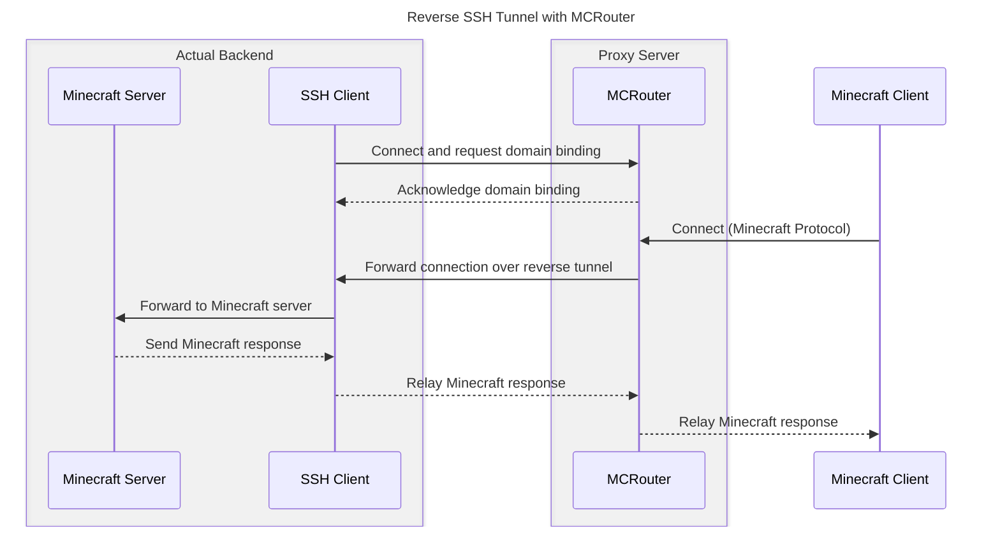

# Usage

Run the application with the required flags:

```sh
./mcrouter -k /path/to/ssh/private/key -a /path/to/auth/directory
```

## Command Line Options

- `-S, --ssh`: SSH listen address (default: `127.0.0.1:2222`)
- `-M, --minecraft`: Minecraft listen address (default: `127.0.0.1:25565`)
- `-k, --key`: SSH Server private key file (required)
- `-a, --auth`: SSH Server auth directories (default: `users`)
- `-I, --ban-ip`: Ban IP addresses that tried to ping Minecraft server directly
- `-D, --ban-duration`: Ban duration in hours (default: `48`)
- `-R, --rejected`: Log rejected connections
- `-w, --whitelist`: Domain names allowed to connect
- `-b, --blacklist`: Domain names denied to connect

## Docker

### Building the Docker Image

Build the Docker image with:

```sh
docker build -t mcrouter .
```

### Running with Docker

#### Basic Usage

Run the container with default settings:

```sh
docker run -d -p 2222:2222 -p 25565:25565 \
  -v /path/to/keys:/app/keys \
  -v /path/to/users:/app/users \
  --name mcrouter mcrouter
```

#### Advanced Usage

Run with custom configuration using environment variables:

```sh
docker run -d -p 2222:2222 -p 25565:25565 \
  -v /path/to/keys:/app/keys \
  -v /path/to/users:/app/users \
  -e SSH_LISTEN=0.0.0.0:2222 \
  -e MINECRAFT_LISTEN=0.0.0.0:25565 \
  -e SSH_KEY_PATH=/app/keys/id_rsa \
  -e AUTH_DIR=/app/users \
  -e BAN_IP=true \
  -e BAN_DURATION=48 \
  -e LOG_REJECTED=true \
  -e WHITELIST_DOMAINS="example.com *.example.com" \
  -e BLACKLIST_DOMAINS="bad.com *.bad.com" \
  --name mcrouter mcrouter
```

### Environment Variables

The following environment variables can be configured:

- `SSH_LISTEN`: SSH listen address (default: `0.0.0.0:2222`)
- `MINECRAFT_LISTEN`: Minecraft listen address (default: `0.0.0.0:25565`)
- `SSH_KEY_PATH`: Path to SSH server private key (default: `/app/keys/id_rsa`)
- `AUTH_DIR`: Path to authentication directory (default: `/app/users`)
- `BAN_IP`: Whether to ban IPs that try to connect directly (default: `false`)
- `BAN_DURATION`: Ban duration in hours (default: `48`)
- `LOG_REJECTED`: Whether to log rejected connections (default: `false`)
- `WHITELIST_DOMAINS`: Space-separated list of allowed domains
- `BLACKLIST_DOMAINS`: Space-separated list of denied domains

### Volumes

The container uses two volumes for persistent data:

- `/app/keys`: Directory for SSH private keys
- `/app/users`: Directory for user authentication files

### Notes

- An SSH private key will be automatically generated if not found at the specified path
- The auth directory should contain YAML files for user authentication as described in the Configuration section

### Docker Hub

The Docker image is automatically built and published to Docker Hub as `eslym/mcrouter` using GitHub Actions. The
workflow is triggered on:

- Pushes to the `main` branch (tagged as `latest`)
- Release tags (tagged with the version number)

To use the pre-built image from Docker Hub:

```sh
docker pull eslym/mcrouter
```

Then run it as described in the [Running with Docker](#running-with-docker) section.

### Docker Compose

#### Proxy Server (MCRouter)

You can use Docker Compose to run MCRouter. Here's an example `docker-compose.yaml` for the proxy server:

```yaml
services:
  app:
    image: eslym/mcrouter:latest
    restart: always
    ports:
      - "4422:2222"
      - "25565:25565"
    environment:
      BAN_IP: true
      LOG_REJECTED: true
    volumes:
      - "/root/mcrouter/keys:/app/keys"
      - "/root/mcrouter/users:/app/users"
```

This configuration:
- Uses the official `eslym/mcrouter` image
- Maps port 4422 on the host to port 2222 in the container (SSH)
- Maps port 25565 on the host to port 25565 in the container (Minecraft)
- Enables IP banning for direct connections
- Enables logging of rejected connections
- Mounts volumes for SSH keys and user authentication files

#### Game Server (Minecraft) with Tunnel

For the Minecraft server side, we recommend using [setupmc.com](https://setupmc.com) to generate your game service configuration. Then add a tunnel service to connect to MCRouter:

```yaml
# Game service generated by setupmc.com
services:
  game:
    image: itzg/minecraft-server:latest
    tty: true
    stdin_open: true
    environment:
      EULA: "TRUE"
      TYPE: "PAPER"
      VERSION: "1.21.4"
      MEMORY: "6144M"
      MOTD: "My Minecraft Server"
      USE_AIKAR_FLAGS: "true"
      DIFFICULTY: "3"
      ENFORCE_SECURE_PROFILE: "false"
    volumes:
      - "./data:/data"
  tunnel:
    build:
      context: .
      dockerfile_inline: |
        FROM alpine:latest
        RUN apk add --no-cache openssh autossh
    tty: true
    # use stdin_open to keep the session stay connected
    stdin_open: true
    network_mode: service:game
    volumes:
      - ${SSH_PRIVATE_KEY_PATH:-./id_rsa}:/root/.ssh/${KEY_NAME:-id_rsa}:ro
    environment:
      - MCROUTER_DOMAIN=${MCROUTER_DOMAIN:-example.com}
      - MCROUTER_SERVER=${MCROUTER_SERVER:-mcrouter.example.com}
      - MCROUTER_PORT=${MCROUTER_PORT:-4422}
      - MCROUTER_USER=${MCROUTER_USER:-user}
      - ENABLE_PROXY_PROTOCOL=${ENABLE_PROXY_PROTOCOL:-false}
      - KEY_NAME=${KEY_NAME:-id_rsa}
    # spigot accepts proxy protocol connection if configured
    command: >
      autossh -M 0 -o StrictHostKeyChecking=no -o ServerAliveInterval=10 -o ServerAliveCountMax=3 
      -i /root/.ssh/${KEY_NAME:-id_ed25519} 
      -R ${MCROUTER_DOMAIN}:25565:localhost:25565 
      -p ${MCROUTER_PORT} 
      ${MCROUTER_USER}@${MCROUTER_SERVER} 
      proxy $([[ "${ENABLE_PROXY_PROTOCOL}" == "true" ]] && echo "-E " || echo "-D ") ${MCROUTER_DOMAIN}
```

This configuration:
- Sets up a Minecraft server using the `itzg/minecraft-server` image (generated by setupmc.com)
- Creates a tunnel service that:
  - Uses Alpine Linux with OpenSSH and AutoSSH installed
  - Shares the network namespace with the game service
  - Mounts an SSH private key for authentication
  - Establishes a reverse SSH tunnel to the MCRouter server
  - Explicitly enables or disables PROXY protocol for the domain based on the `ENABLE_PROXY_PROTOCOL` environment variable

The tunnel service uses the following environment variables:
- `MCROUTER_DOMAIN`: Your domain name for the Minecraft server (e.g., `mc.example.com`)
- `MCROUTER_SERVER`: The hostname or IP address of your MCRouter server
- `MCROUTER_PORT`: The SSH port of your MCRouter server (default: 4422)
- `MCROUTER_USER`: Your username on the MCRouter server
- `SSH_PRIVATE_KEY_PATH`: Path to your SSH private key (default: ./id_ed25519)
- `KEY_NAME`: Name of the SSH key file inside the container (default: id_ed25519)
- `ENABLE_PROXY_PROTOCOL`: Whether to enable (true) or disable (false) PROXY protocol for the domain (default: false)

You can set these environment variables in a `.env` file or directly in your docker-compose command:

```sh
MCROUTER_DOMAIN=mc.example.com \
MCROUTER_SERVER=mcrouter.example.com \
MCROUTER_USER=myuser \
MCROUTER_PORT=4422 \
SSH_PRIVATE_KEY_PATH=./path/to/private_key \
KEY_NAME=my_private_key \
ENABLE_PROXY_PROTOCOL=true \
docker-compose up -d
```

Make sure to:
1. Generate your game service configuration at [setupmc.com](https://setupmc.com)
2. Set the environment variables with your own values
3. Generate an SSH key pair and specify the path to the private key
4. Add the public key to the authorized keys in the MCRouter user configuration

## How It Works

The following diagram illustrates how MCRouter works with reverse SSH tunnels:



### Technical Details

MCRouter is designed to provide a secure and flexible way to expose Minecraft servers through domain-based routing using
SSH reverse tunnels. Here's a detailed explanation of how it works:

#### Authentication and Security

1. **SSH Authentication**: MCRouter supports two authentication methods:
    - **Public Key Authentication**: Users can authenticate using SSH keys stored in their user configuration files.
    - **Password Authentication**: Users can authenticate with passwords defined in their user configuration files.

2. **User Configuration**: User configurations are stored in YAML files within the auth directory, containing:
    - Passwords (if using password authentication)
    - Authorized SSH keys (if using public key authentication)
    - Allowed domain bindings that the user can register

3. **Domain Binding Authorization**: Users can only bind domains that are explicitly allowed in their configuration
   files, providing a security layer to prevent unauthorized domain registrations.

#### Domain Binding Mechanism

1. **Binding Registration**: When an SSH client connects to MCRouter, it registers domain bindings using SSH reverse
   tunnels:
   ```
   ssh -R example.com:25565:localhost:25565 user@server
   ```
   This command binds the domain `example.com` to port 25565 on the Minecraft server accessible through the SSH client's
   localhost:25565.

2. **Pattern Matching**: MCRouter supports complex domain matching patterns, including wildcards:
    - Exact matches: `example.com` - Matches only the exact domain name
    - Single-level wildcard: `*.example.com` - Matches any single subdomain level (e.g., `www.example.com`, but not
      `sub.www.example.com`)
    - Multi-level wildcard: `**.example.com` - Matches any number of subdomain levels (e.g., `www.example.com`,
      `sub.www.example.com`)
    - TLD wildcard: `*.example.*` - Matches any single subdomain and any TLD (e.g., `www.example.com`,
      `www.example.net`)
    - Combined wildcards: Various combinations of the above patterns

   Domain pattern examples and what they match:

   | Pattern          | Matches                                                       | Doesn't Match                        |
   |------------------|---------------------------------------------------------------|--------------------------------------|
   | `example.com`    | `example.com`                                                 | `www.example.com`, `example.net`     |
   | `*.example.com`  | `www.example.com`, `api.example.com`                          | `example.com`, `sub.www.example.com` |
   | `**.example.com` | `www.example.com`, `sub.www.example.com`, `a.b.c.example.com` | `example.com`, `example.net`         |
   | `*.example.*`    | `www.example.com`, `api.example.net`                          | `example.com`, `sub.www.example.com` |
   | `**.com`         | `example.com`, `www.example.com`, `a.b.c.d.com`               | `example.net`                        |

   These patterns can be used in several places:
    - User configuration's `allowed_bindings` list
    - Command line whitelist/blacklist options (`-w`/`-b`)
    - Docker environment variables (`WHITELIST_DOMAINS`/`BLACKLIST_DOMAINS`)

3. **Binding Management**: The `BindingManager` keeps track of all registered domain bindings and their associated SSH
   connections, ensuring that:
    - Each domain can only be bound to one SSH connection at a time
    - Bindings are automatically removed when the SSH connection is closed
    - Users can only bind domains they are authorized to use

#### Minecraft Protocol Handling

1. **Handshake Processing**: When a Minecraft client connects to MCRouter, it sends a handshake packet containing:
    - Protocol version
    - Server address (domain name)
    - Server port
    - Next state (login or status)

2. **Domain Resolution**: MCRouter extracts the domain from the handshake packet and resolves it to the appropriate SSH
   tunnel using the `BindingManager`.

3. **Security Features**:
    - **IP Banning**: If enabled, MCRouter can automatically ban IP addresses that attempt to connect directly using an
      IP address instead of a domain name.
    - **Domain Whitelisting/Blacklisting**: MCRouter can restrict connections based on domain patterns, allowing only
      specific domains or blocking certain domains.

4. **Connection Forwarding**: If the domain is successfully resolved, MCRouter forwards the Minecraft connection through
   the appropriate SSH tunnel to the target Minecraft server.

#### Data Flow

1. **SSH Tunnel Establishment**:
    - SSH client connects to MCRouter's SSH server
    - Authentication is performed using public key or password
    - SSH client registers domain bindings using the SSH reverse tunnel (`-R` flag)
    - MCRouter acknowledges the domain binding

2. **Minecraft Client Connection**:
    - Minecraft client connects to MCRouter's Minecraft server
    - Client sends handshake packet with domain name
    - MCRouter validates the domain against whitelist/blacklist
    - MCRouter resolves the domain to an SSH tunnel

3. **Connection Forwarding**:
    - MCRouter forwards the Minecraft connection through the SSH tunnel
    - SSH client forwards the connection to the actual Minecraft server
    - Minecraft server responds to the client through the same path
    - All Minecraft protocol data is transparently forwarded in both directions

4. **Proxy Protocol Support**: MCRouter optionally supports the PROXY protocol, which allows the target Minecraft server
   to know the original client's IP address.

#### Session Management

1. **SSH Session Commands**: MCRouter provides several commands for managing domain bindings:
    - `proxy -E <domain>`: Enables PROXY protocol for an existing domain binding
    - `proxy -D <domain>`: Disables PROXY protocol for an existing domain binding
    - `list`: Lists all current domain bindings for the SSH connection
    - `help`: Shows available commands
    - `exit`: Closes the SSH connection

   Example of setting up a tunnel and enabling PROXY protocol in a single command:
   ```bash
   ssh -R example.com:25565:localhost:25565 user@server proxy -E example.com
   ```

2. **Keep-Alive Mechanism**: MCRouter implements a keep-alive mechanism to maintain SSH connections, ensuring that
   domain bindings remain active even during periods of inactivity.

3. **Connection Tracking**: MCRouter tracks all active connections and ensures proper cleanup when connections are
   closed, preventing resource leaks.

By combining these components, MCRouter provides a secure and efficient way to expose Minecraft servers through
domain-based routing, allowing multiple Minecraft servers to be accessible through a single public IP address while
maintaining separation and security.
